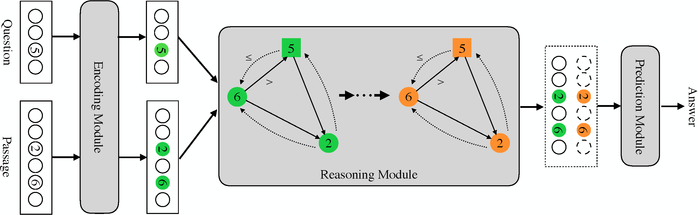

# NumNet: Machine Reading Comprehension with Numerical Reasoning

This is the implementation of [NumNet: Machine Reading Comprehension with Numerical Reasoning](https://www.aclweb.org/anthology/D19-1251/). The code is based on [NAQANet](https://github.com/allenai/allennlp/blob/master/allennlp/models/reading_comprehension/naqanet.py).

## Introduction

Numerical reasoning, such as addition, subtraction, sorting and counting is a critical skill in human's reading comprehension, which has not been well considered in existing machine reading comprehension (MRC) systems. To address this issue, we propose a numerical MRC model named as NumNet, which utilizes a numerically-aware graph neural network to consider the comparing information and performs numerical reasoning over numbers in the question and passage.



## Prerequisite

To use this source code, you need Python3.6+, a few python3 packages and DROP data. The python dependencies can be installed as follows:

```
pip install -r requirements.txt
```

## Data

- augmented\_drop\_dataset\_train.json: The augmented training set.

- comparison.json: This is the “Comparison" set mentioned in the paper. The samples are built by manually swapping answer candidates in the question of the corresponding examples.

## Usage

Before training and inference, please download [DROP](https://allennlp.org/drop) dataset and put it in the `data` directory

### Training

To train the model, you can use the following command. Here `[MODEL_PATH]` is the directory where you want to save your model.

```
allennlp train ./config/config_for_train.json -s [MODEL_PATH] --include-package numnet
```


### Inference

To perform inference, the following command can be used. Here, `[MODEL_PATH]` is the directory where you save your model, and `[FILE_TO_PREDICT]` is the data you want to do inference on.

```
python predict.py  --include-package numnet --archive_file [MODEL_PATH]  --input_file [FILE_TO_PREDICT]  --output_file ./predictions.json
```


## Citation

```bibtex
@inproceedings{ran2019numnet,
    title={{N}um{N}et: Machine Reading Comprehension with Numerical Reasoning},
    author={Ran, Qiu and Lin, Yankai  and Li, Peng  and Zhou, Jie  and Liu, Zhiyuan},
    booktitle={Proceedings of the 2019 Conference on Empirical Methods in Natural Language Processing and the 9th International Joint Conference on Natural Language Processing (EMNLP-IJCNLP)},
    pages={2474--2484},
    year={2019}
}
```

